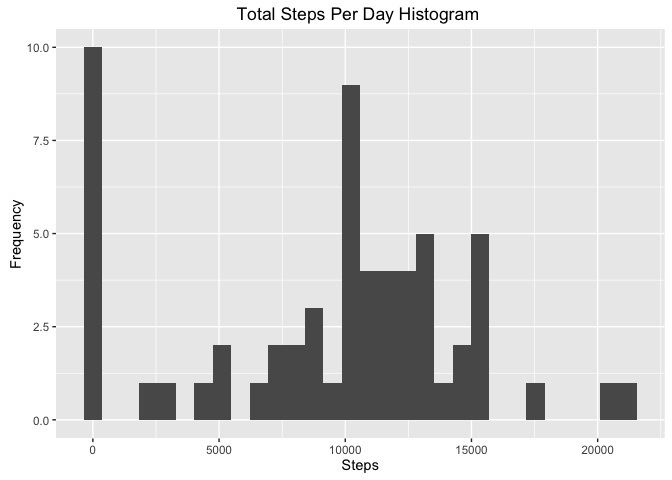
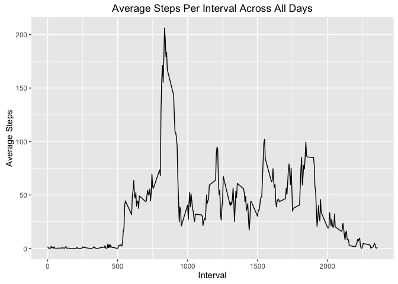
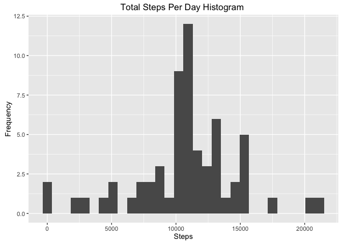
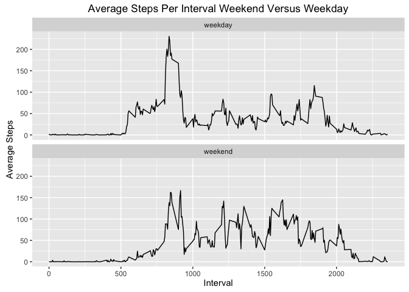

# Reproducible Research: Peer Assessment 1
Don Hescht  


## Loading and preprocessing the data

```r
act.df <- read.csv("activity.csv", stringsAsFactors=FALSE)
act.df$date <- as.Date(act.df$date)
```

## What is mean total number of steps taken per day?

```r
act.total.day <- act.df %>% group_by(date) %>% summarise(total=sum(steps,na.rm=TRUE))
act.mean <- mean(act.total.day$total,na.rm=TRUE)
act.median <- median(act.total.day$total,na.rm=TRUE)

g <- ggplot(act.total.day, aes(total)) +  geom_histogram()
g <- g + xlab("Steps") + ylab("Frequency") + ggtitle("Total Steps Per Day Histogram ")
g
```

<!-- -->

The **mean steps per day = 9354** while the **median steps per day = 10395**. 

## What is the average daily activity pattern?

```r
act.mean.interval <- act.df %>% group_by(interval) %>% summarise(average=mean(steps,na.rm=TRUE))
act.max.interval <- max(act.mean.interval$average,na.rm=TRUE)

g <- ggplot(act.mean.interval, aes(interval, average)) +  geom_line()
g <- g + xlab("Interval") + ylab("Average Steps") + ggtitle("Average Steps Per Interval Across All Days")
g
```

<!-- -->

The **max average steps (206)** occurred **at interval 835**.

## Imputing missing values
The activity dataset **contains 2304 NA rows** of 17568 total rows. To make a complete data set the **NAs for a given interval will be replaced with the average value for that interval across all days**.

```r
act.df$steps[is.na(act.df$steps)] <- act.mean.interval$average[match(act.df$interval[is.na(act.df$steps)], act.mean.interval$interval)]
# Create a total 
act.nona.total.day <- act.df %>% group_by(date) %>% summarise(total=sum(steps,na.rm=TRUE))
act.nona.mean <- mean(act.nona.total.day$total,na.rm=TRUE)
act.nona.median <- median(act.nona.total.day$total,na.rm=TRUE)

g <- ggplot(act.nona.total.day, aes(total)) +  geom_histogram()
g <- g + xlab("Steps") + ylab("Frequency") + ggtitle("Total Steps Per Day Histogram ")
g
```

<!-- -->

The **NA corrected histogram has less zeros** as these NA zero values are now distributed in other intervals around averages for the intervals.  The **mean steps per day before NA correction = 9354** and **after = 10766**.  The **median steps per day before NA correction =  10395** and **after = 10766**. 

## Are there differences in activity patterns between weekdays and weekends?


```r
weekend <- c("weekend","weekday","weekday","weekday","weekday","weekday", "weekend")
act.df$weekend <- as.factor(weekend[wday(act.df$date)])
act.weekday.mean.day <- act.df %>% group_by(interval,weekend) %>% summarise(average=mean(steps,na.rm=TRUE))
g <- ggplot(act.weekday.mean.day, aes(interval, average)) +  geom_line() + facet_wrap(~weekend, nrow=2)
g <- g + xlab("Interval") + ylab("Average Steps") + ggtitle("Average Steps Per Interval Weekend Versus Weekday")
g
```

<!-- -->
